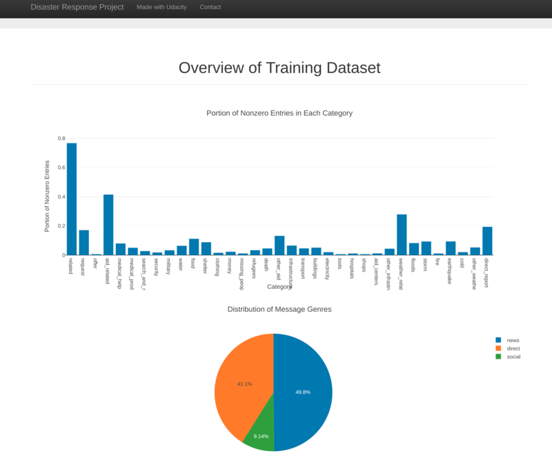
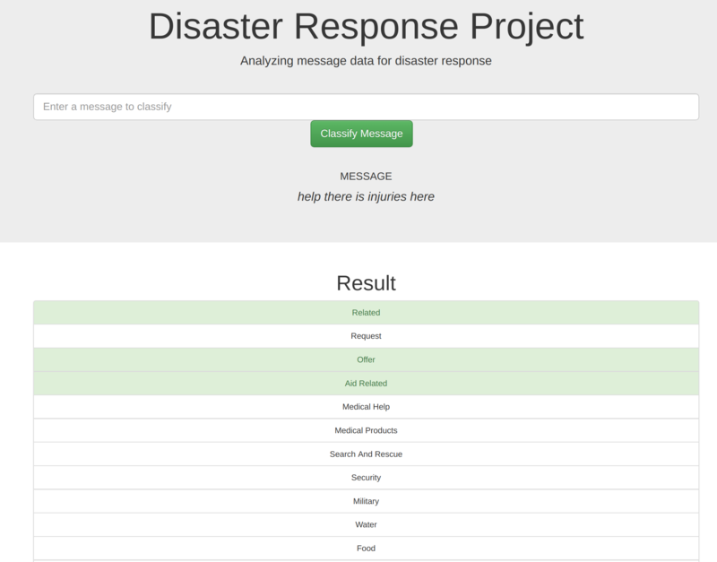

# Disaster Response Pipeline Project

### Summary
This project uses ETL pipeline and sklearn pipeline to analyze the disaster response messages and create and optimize a machine learning model to predict the disaster response.

Then analysis result is visualized on web application.

In the ETL, the text messages and their categories are loaded from csv files. Then the input texts are tokenized and lemmatized. Then the tfidf matrix is built as the predictor for the machine learning model. The categories data are converted to numeric values and are used as the predicted parameters for the machine learning model. 

### Files
The files in this project include the following:

* app
    * template
        * master.html  # main page of web app
        * go.html  # classification result page of web app
    * run.py  # Flask file that runs app

* data
    * disaster_categories.csv  # data to process 
    * disaster_messages.csv  # data to process
    * process_data.py
    * DisasterResponse.db   # database to save clean data to

* models
    * train_classifier.py  #machine learning model
    * classifier.pkl  # saved model 

* pictures
    * screenshot1.png  #screenshot of the web app
    * screenshot2.png  #another screenshot of the web app

### Instruction to run the scripts:
1. In the root directory

    - To run ETL pipeline that cleans data and stores in database
        `python data/process_data.py data/disaster_messages.csv data/disaster_categories.csv data/DisasterResponse.db`
    - To run ML pipeline that trains classifier and saves
        `python models/train_classifier.py data/DisasterResponse.db models/classifier.pkl`

2. Run the following command in the app's directory to run the web app.
    `python run.py`

3. Go to http://0.0.0.0:3001/

### Web app screenshots

The following are some screenshots of the web app.

